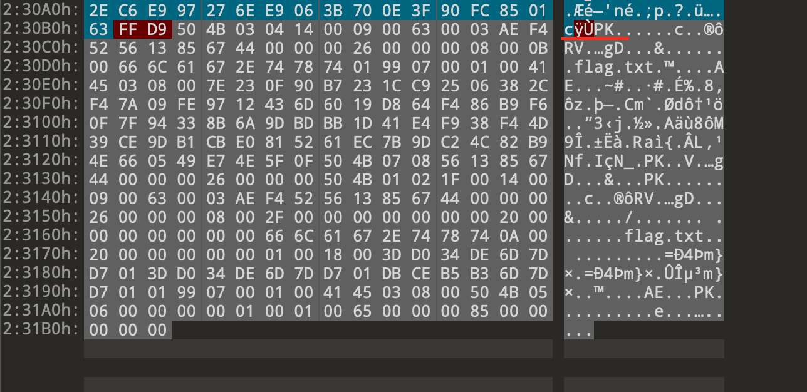

## 用010Editor打开图片



发现图片最后有个PK开头的标识，表示是一个压缩包，里面有个flag.txt的文件

使用binwalk检查图片

```shell
binwalk ./2021.jpg 

DECIMAL       HEXADECIMAL     DESCRIPTION
--------------------------------------------------------------------------------
0             0x0             JPEG image data, JFIF standard 1.01
30            0x1E            TIFF image data, big-endian, offset of first image directory: 8
143539        0x230B3         Zip archive data, encrypted at least v2.0 to extract, compressed size: 68, uncompressed size: 38, name: flag.txt
143773        0x2319D         End of Zip archive, footer length: 22

```

提取zip文件包

```shell
binwalk -e ./2021.jpg

DECIMAL       HEXADECIMAL     DESCRIPTION
--------------------------------------------------------------------------------
0             0x0             JPEG image data, JFIF standard 1.01
30            0x1E            TIFF image data, big-endian, offset of first image directory: 8

WARNING: Extractor.execute failed to run external extractor '7z x -y '%e' -p ''': [Errno 2] No such file or directory: '7z': '7z', '7z x -y '%e' -p ''' might not be installed correctly
143539        0x230B3         Zip archive data, encrypted at least v2.0 to extract, compressed size: 68, uncompressed size: 38, name: flag.txt
143773        0x2319D         End of Zip archive, footer length: 22

```

生成230B3.zip压缩包


